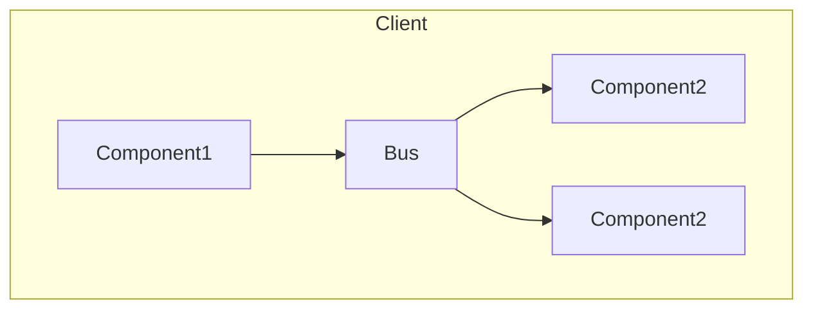
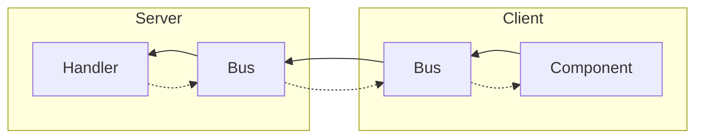

# Message Bus
## Origin
Inspired by Jeffrey Palermo: [Jeffrey@Github](https://github.com/jeffreypalermo)
- [blazor-wasm-single-web-api](https://github.com/jeffreypalermo/blazor-wasm-single-web-api)
- [Blazor MVC](https://github.com/jeffreypalermo/blazormvc)

## UI Message Bus

### Sending Component
The bus is available to the components by injection.
### Bus
The bus is registered as a service on the client app. It contains a list of subscribers and exposes the notify method.
### Receiving Componnent
The components must subscribe to the bus to receive messages.

## API Message Bus

### Component
The bus is available to the component by injection.
### Bus
The bus is registered as a service on both client and server app. 
A controller is implemented in the server app to receive messages and pass them on to the bus on the server.
### Handler
A handler class for each message type is implemented on the server app. The bus passes the call to the handler.
### Response
All parts of the chain from the component to the handler returns Task of response type. This enables data to be passed back down the chain.

### Embedding charts:
- [Mermaid Documentation](https://mermaid-js.github.io/mermaid/#/)
- [Mermaid Live Editor](https://mermaid.live/)