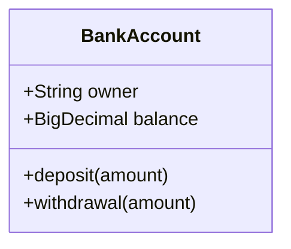

# Message Bus
## Origin
Inspired by Jeffrey Palermo: [Jeffrey@Github](https://github.com/jeffreypalermo)
- [blazor-wasm-single-web-api](https://github.com/jeffreypalermo/blazor-wasm-single-web-api)
- [Blazor MVC](https://github.com/jeffreypalermo/blazormvc)

## UI Message Bus

## API Message Bus
